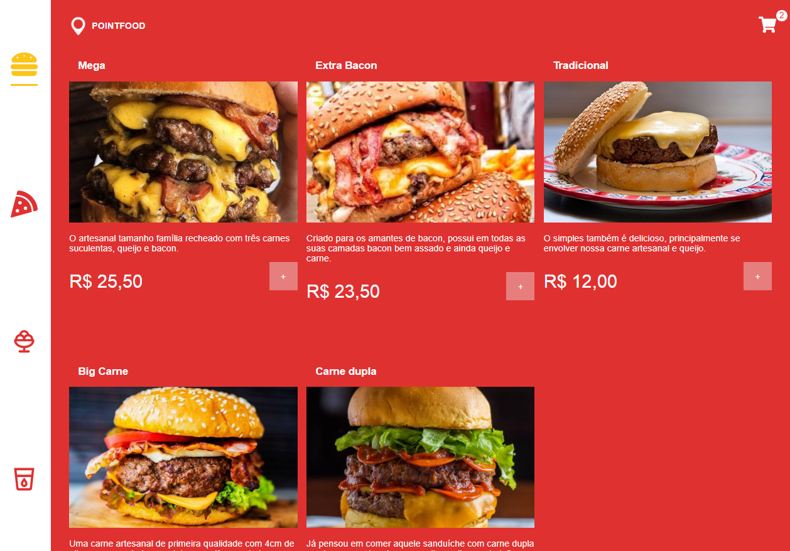
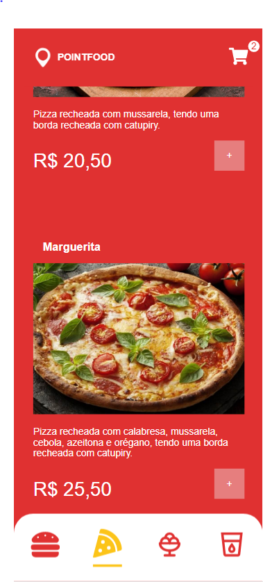

# PointFood

Um simples e funcional sistema de pedidos online.

## Índice

- [Sobre](#sobre)
- [Recursos](#recursos)
- [Capturas de Tela](#capturas-de-tela)
- [Demo](#demo)

## Sobre

O PointFood é um sistema cardápio online desenvolvido para simplificar os pedidos on e melhorarline  a experiência de clientes. Este sistema permite uma interface fácil de usar para clientes realizarem pedidos online.

## Recursos

- Listagem de produtos
- Carrinho de compra
- formulario de pedido
- envio de pedido para whatsapp

## Capturas de Tela

## Demo
Acesse o demo do projeto: https://pointfood.vercel.app

